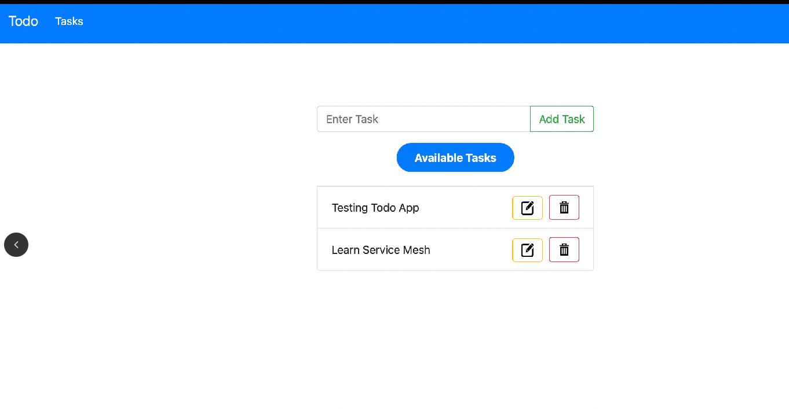
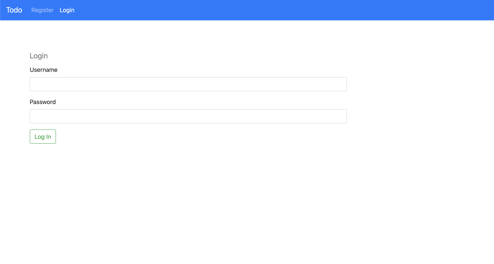

# Proyecto Microservicios

Esta es una aplicación de tareas basada en una arquitectura de microservicios. Desarrollé este proyecto mientras aprendía sobre Docker, Kubernetes y gRPC.

---

## Servicios y tecnologías utilizadas:

- **Frontend**
  - Lenguaje/Framework: HTML, CSS, JavaScript
  - Descripción: Aplicación web simple escrita en HTML, CSS y JavaScript puro. Su imagen de Docker utiliza `apache httpd` para servir la aplicación.

- **API Service**
  - Lenguaje/Framework: Python, FastAPI
  - Descripción: Servicio que expone APIs RESTful con las que se comunica el `frontend`. No contiene mucha lógica de negocio; en su lugar, se comunica con los servicios `auth-service` y `todo-service` mediante `gRPC`. Las definiciones de protobuf están [aquí](./protobuf/).

- **Auth Service**
  - Lenguaje/Framework: Go
  - Descripción: Encargado de la autenticación, registro, etc. Almacena los datos en una base de datos `PostgreSQL`.

- **Todo Service**
  - Lenguaje/Framework: TypeScript
  - Descripción: Gestiona todas las operaciones CRUD de las tareas. Almacena los datos en una base de datos `MongoDB`.

---

# Ejecución de la Aplicación

## Construcción de Imágenes Docker

Para ejecutar esta aplicación, primero debes construir las imágenes Docker de todos los servicios:

### Frontend

```bash
cd frontend
docker build -t todo-app-frontend:v1 .
```

### Auth Service

```bash
cd auth-service
docker build -t todo-app-auth-service:v1 .
```

### Todo Service

```bash
cd todo-service
docker build -t todo-app-todo-service:v1 .
```

### API Service

```bash
cd api-service
docker build -t todo-app-api-service:v1 .
```

---

## Despliegue en clúster de Kubernetes

### Crear un namespace llamado `todo-app`

```bash
kubectl create ns todo-app
```

### Aplicar los manifiestos

```bash
kubectl apply -f kubernetes/
```

---

# Capturas de Pantalla

## Aplicación de Tareas

| Página Principal | Página de Inicio de Sesión |
|------------------|-----------------------------|
|  |  |

